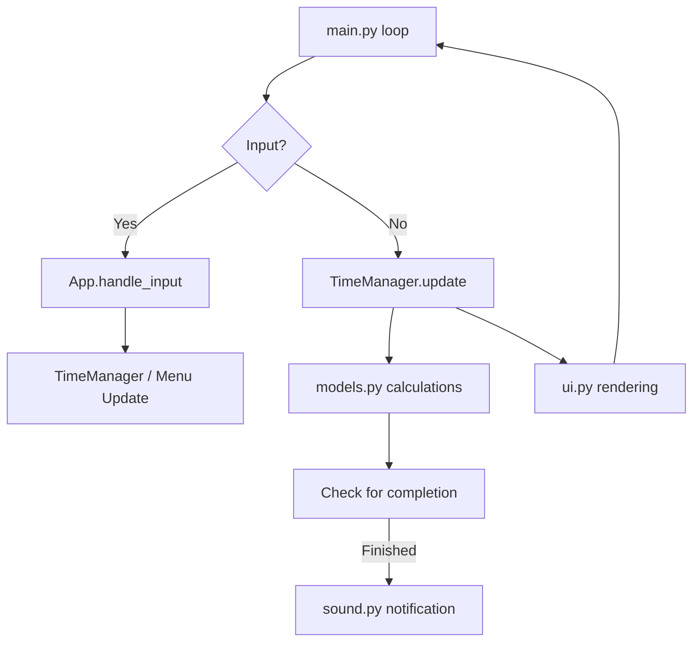

# Code Documentation - Timer CLI

## Project Overview
Timer CLI is a modular, cross-platform terminal application designed for managing multiple concurrent timers and stopwatches. It uses an MVC-like architecture to separate data management, user interface rendering, and application control.

## Directory Structure
```text
timer_cli/
├── src/
│   ├── main.py           # Entry point, event loop, input handling
│   ├── managers.py       # State management for multiple timers/stopwatches
│   ├── models.py         # Core logic for Timer and Stopwatch objects
│   ├── ui.py             # Curses-based rendering engine
│   ├── sound.py          # Cross-platform sound notification logic
│   ├── utils.py          # Shared helper functions (format_time)
│   └── logging_setup.py  # Structured logging with global path resolver
├── LICENSE               # GPL v3 License
├── pyproject.toml        # Build system and dependencies
├── run_timer.bat         # Windows Launcher
└── run_timer.sh          # Linux/macOS Launcher
```

## High-Level Architecture
The application follows a standard TUI loop pattern:
1.  **Input**: Non-blocking key detection (`curses.getch`).
2.  **Update**: Advance timer states, check for completion, trigger notifications.
3.  **Render**: Redraw the screen based on the current system state.

## Core Modules

| Module | Responsibility |
| :--- | :--- |
| **`models.py`** | Defines `Timer` (countdown) and `Stopwatch` (countup) classes. Handles time calculation using the system clock (`time.time()`) rather than sleep-based ticking. |
| **`managers.py`** | The `TimeManager` class tracks all active timers and stopwatches. It provides methods to add, remove, and update all items globally. |
| **`ui.py`** | Contains `render_app` and `draw_progress_bar`. Responsible for efficient `curses` window updates and Selection Mode highlighting. |
| **`main.py`** | Coordinates the `App` lifecycle. Manages the shared `Menu`, handles user input, and drives the main loop. Implements the **History Viewer** within the `App` class, featuring hierarchical grouping of events by unique item ID and an optional "Raw" log view toggle. |

## Data Flow


## Dependencies
- **Standard Library**: `curses`, `time`, `threading`, `uuid`, `logging`, `subprocess`.
- **Third Party**: `windows-curses` (Windows only) for native curses support.

## Execution Flow
1.  User runs `run_timer.bat`.
2.  `main.py` initializes `curses`, sets up color pairs, and starts the `App`.
3.  The `App` enters a non-blocking while-loop (~20 FPS).
4.  User inputs (like `New Timer`) pause the main loop to show a modal input overlay using `get_user_input`.
5.  State persists in a centralized log file located in the user's home directory (e.g., `~/.timer_cli/timer_cli.log` on Unix or `%USERPROFILE%\.timer_cli\timer_cli.log` on Windows). The History Viewer dynamically parses this file to reconstruct item lifecycles.
